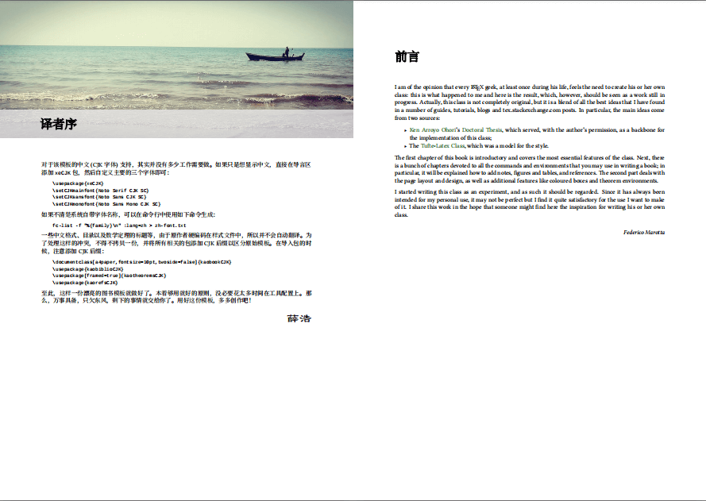
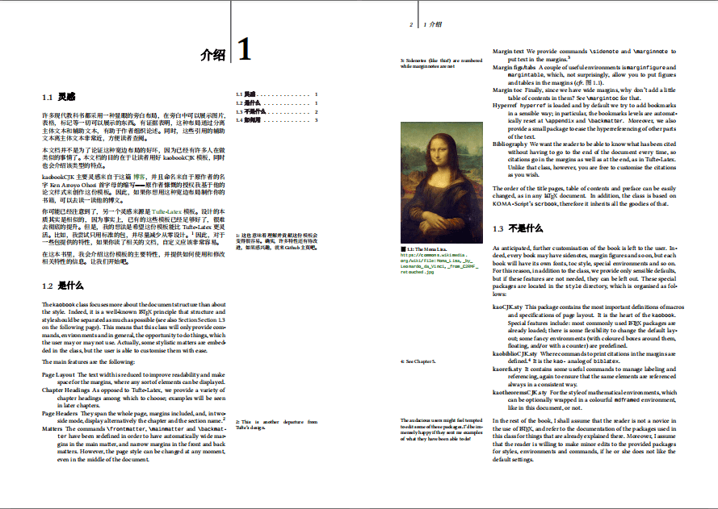
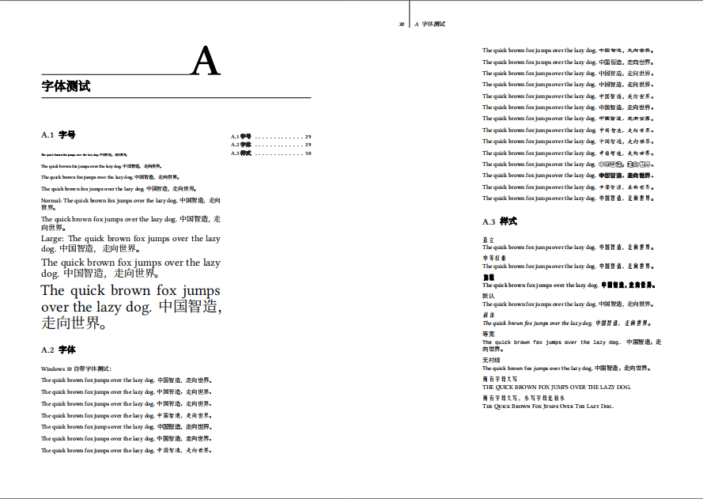

# kaobookCJKsc - 一个美观的简体中文 LaTeX 模板

## 使用

复制 `kaobookCJKsc` 所有文件到项目同级目录：

```
.
├── styles
│   ├── kaobiblioCJKsc.sty
│   ├── kaobookCJKsc.cls
│   ├── kaoCJKsc.sty
│   ├── kaoWinCJKsc.sty
│   ├── kaohandtCJKsc.cls
│   ├── kaorefsCJKsc.sty
│   ├── kaotheoremsCJKsc.sty
│   └── config.tex
├── main.tex                                  # 你的 LaTeX 文件
├── Compiling.cmd
└── Cleaning.cmd
```

编译需要切换到 `xelatex`，`Windows` 平台搭配 `MiKTeX` 发行版，可以直接使用 `Compiling.cmd` 实现一键编译，其他平台类似。

编译过程参考以下命令：

```latex
xelatex main                                  # 预编译模板
makeindex main.nlo -s nomencl.ist -o main.nls # 编译索引
makeindex main                                # 编译索引
biber main                                    # 编译参考文献
makeglossaries main                           # 编译字母表
xelatex main                                  # 再次编译
xelatex main                                  # 两到三次
xelatex main                                  # 防止边注错位
```

默认使用美观、大方又开源的 [Google Noto](https://github.com/googlefonts/noto-cjk) 字体。如需自定义，可以在配置中自行设定。另外，原版英文字体需安装 `liberation` 系列字体，一并安装。

> 字体备份：[百度云链接](https://pan.baidu.com/s/1r7qphMtlCdT9M3q26cokfA?pwd=uc75)

## 示例

包含三个简体中文示例，可以自行测试：

- documentation_CJKsc
- minimal_book_CJKsc
- minimal_report_CJKsc

## 演示







## FAQ:

- [TeX capacity exceeded, sorry [main memory size=3000000]](https://tex.stackexchange.com/a/548335)
